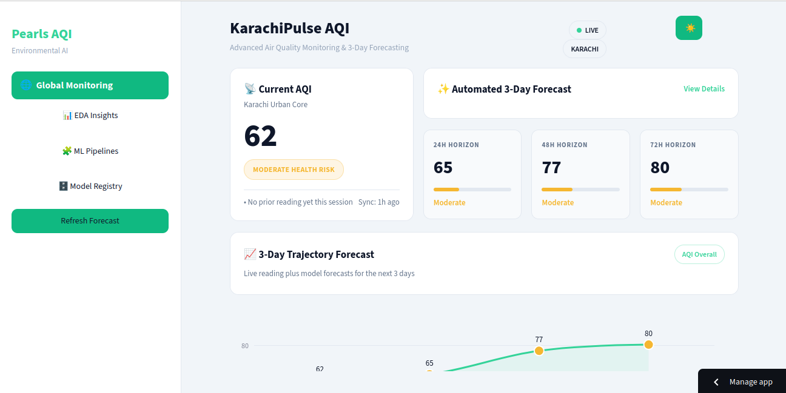
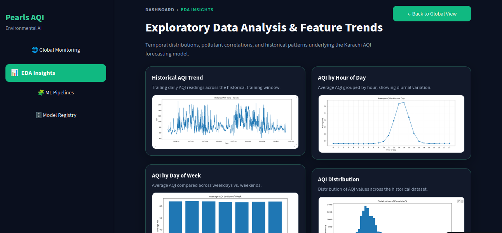
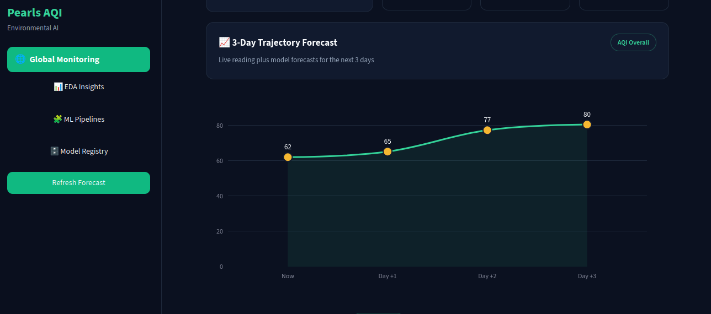
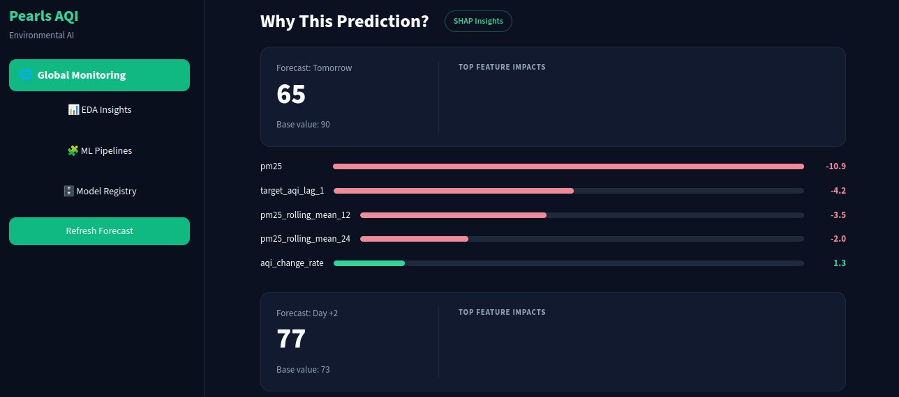
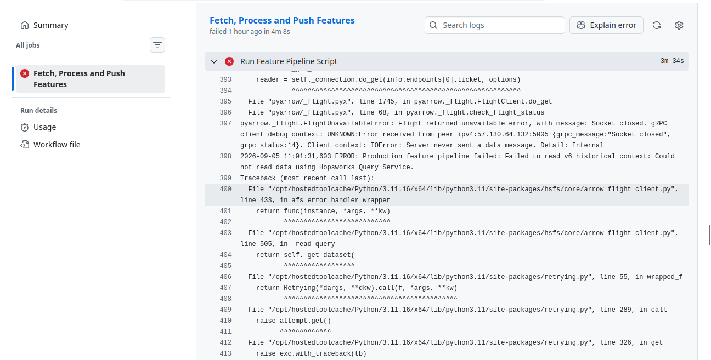

# Comprehensive Project Report: Karachi 3-Day AQI Prediction & MLOps Pipeline

**Author:** Neha Kumari  
**Program:** 10Pearls Shine Cohort 9 Internship  
**Project:** End-to-End Air Quality Index (AQI) Forecasting and Monitoring System  
**Live Application Link:** [pearlsaqipredictor-g5cgabkya5ykm6yx4zm5jp.streamlit.app](https://pearlsaqipredictor-g5cgabkya5ykm6yx4zm5jp.streamlit.app/)

## 1. Executive Summary & Project Introduction

Monitoring and forecasting air quality in a bustling metropolitan city like Karachi is vital for public health awareness and environmental planning. This project was undertaken to build a robust, production-grade Machine Learning Operations (MLOps) pipeline. Instead of relying on a static notebook prototype, the objective was to implement an automated system that handles raw environmental data ingestion, feature store management, multi-horizon model training, REST API serving, and an interactive frontend dashboard for stakeholders.

The core focus of the system is to forecast air quality across three specific future horizons—Day +1 (24 hours ahead), Day +2 (48 hours ahead), and Day +3 (72 hours ahead)—while ensuring transparency through model explainability and automated hazardous condition alerts.


## 2. System Architecture & Data Flow

To ensure scalability, clean code separation, and reproducibility, the project architecture is broken down into distinct decoupled layers:

```text
Open-Meteo API (Raw Environmental & Meteorological Data)
          │
          ▼
 Feature Engineering Pipeline (`src/feature_pipeline.py`)
          │  - Canonical 100-Feature Contract & Rich Historical Lags
          ▼
 Hopsworks Feature Store (`karachi_aqi_features` v6)
          │
          ├──> Model Training & Registration (XGBoost & Ridge Regressors)
          │          │
          │          ▼
          │    Hopsworks Model Registry (Artifact & Metrics Tracking)
          │          │
          │          ▼
          └────> Unified Streamlit Dashboard & Inference Engine (`web_app/app.py`)
                     │  - Direct In-App Inference & SHAP Calculations
                     ▼
             Live End-User Interface (Streamlit Cloud Deployment)
```
## 3. Technology Stack & Tools Used

The following industry-standard tools and technologies were utilized across different stages of development:

* **Core Programming:** Python 3.10+, Pandas, NumPy for data manipulation and numerical computations.
* **Machine Learning & Modeling:** Scikit-learn (baseline models), XGBoost (non-linear gradient boosting), Joblib for model serialization.
* **MLOps & Feature Management:** Hopsworks Feature Store and Model Registry for centralized versioning and feature sharing.
* **Data Ingestion:** Open-Meteo historical and forecast APIs for robust meteorological and pollutant data streams.
* **Backend Framework:** FastAPI to handle asynchronous inference requests, caching, and health checks.
* **Frontend Dashboard:** Streamlit for building an intuitive user interface with live forecast cards and visual alerts.
* **Model Explainability:** SHAP (SHapley Additive exPlanations) for transparent feature attribution analysis.
* **Environment & Version Control:** Git, GitHub, Python Virtual Environments (`venv`), and dotenv for secure configuration management.

---

## 4. Key Implementation Phases

### A. Exploratory Data Analysis (EDA) & Data Pipeline Setup

Initial exploratory data analysis was performed on historical Karachi weather and air quality records spanning over two years (17,000+ rows). I analyzed temporal trends across hours and days to understand traffic and emission cycles, examining correlations between particulate matter ($PM_{2.5}$, $PM_{10}$), gaseous pollutants, and weather parameters like temperature and humidity. Visual assets capturing these distributions were integrated into the monitoring dashboard.

### B. Feature Engineering & Canonical Feature Contract

To prevent training-serving skew, a strict **100-feature canonical contract** was established. Initial models built solely on basic time attributes (hour, day, month), basic change rates, and simple pollutant readings suffered from limited signal representation. Following mentorship guidance, the feature set was significantly expanded to include rich historical context: multi-hour pollutant lags, rolling statistical means, and standard deviations over recent intervals.

### C. Multi-Horizon Forecasting Models

Instead of a single generalized predictor, distinct models were tailored for each forecast horizon:

* **Day +1:** Powered by an optimized XGBoost regressor to capture complex non-linear short-term patterns.
* **Day +2 & Day +3:** Built using regularized Ridge regression models to maintain stability and prevent overfitting over extended temporal windows.

### D. Model Explainability & Alerting

The system incorporates SHAP explanations to break down individual predictions, showing users which specific environmental factors (such as wind speed or elevated $PM_{2.5}$) drove a particular forecast. Additionally, a threshold-based alert system was built into the dashboard to trigger visual warning banners when hazardous air quality levels are detected.

---
## 5. System Interface and Dashboard Overview

The deployed Streamlit monitoring application integrates multiple operational layers of the pipeline into an intuitive web interface:

* **Real-Time Global AQI Monitoring:** Displays the latest live AQI score,, latest timestamp verification, and automated feature validation checks.
* **Multi-Horizon Trajectory Forecasts:** Visualizes Day +1 (XGBoost), Day +2 (Ridge), and Day +3 (Ridge) predicted AQI trends.
* **Model Explainability (SHAP):** Computes feature contributions dynamically to ensure model transparency.






## 6. Challenges Faced & Practical Solutions Found

Building a production-ready MLOps pipeline came with several technical roadblocks that required iterative troubleshooting:

1. **Hopsworks Project Creation & Namespace Conflict:**
* *The Problem:* Initially, while setting up the project on Hopsworks, repeated attempts to create the project failed or threw errors without clear reasons.
* *The Solution:* Realized that Hopsworks enforces globally unique namespace naming conventions across the platform. By assigning a completely unique and specific project name (`My_AQI_Project`), the project was successfully initialized and provisioned.


2. **Live Data Stagnation and API Scale Mismatch:**
* *The Problem:* Initially, AQICN was integrated for live data fetching, but it resulted in stagnant readings with AQI values persistently locked at 161. Switching to OpenWeather for live data while retaining Open-Meteo for history created a severe scale mismatch between feature ranges, disrupting model predictions.
* *The Solution:* I unified the entire data pipeline by exclusively utilizing **Open-Meteo** for both historical records and live data fetching, completely removing the unreliable AQICN fallback and OpenWeather integration to ensure uniform data scaling.


3. **Overcoming Low Initial $R^2$ Scores:**
* *The Problem:* Across initial experiments with Random Forest, Deep PyTorch, and baseline Ridge, the Day 1 $R^2$ score stubbornly hovered around 0.4+.
* *The Solution:* Consulting my mentor clarified that an $R^2$ of ~0.4 is common in noisy AQI forecasting if evaluated against simple time features alone. Following her advice, I performed deeper EDA, dropped random splits in favor of strict time-based splits, and engineered rich historical features (lags and rolling statistics). Consequently, the models successfully beat the persistence baseline and improved consistently through daily training cycles.


4. **Feature Mismatch Between Training and Inference:**
* *The Problem:* Discrepancies occasionally occurred where feature shapes or column orders during inference did not match those registered in Hopsworks.
* *The Solution:* Enforced a strict canonical feature contract script (`feature_engineering.py`) to guarantee identical feature generation, sorting, and validation checks prior to both training and inference.


5. **FastAPI Latency and Hopsworks Query Bottlenecks:**
* *The Problem:* Initially, every incoming `/predict` request queried the Hopsworks feature store and reloaded models live, taking 13–14 seconds per request and causing noticeable response delays.
* *The Solution:* Following mentorship advice, the architecture was optimized so that models are loaded once at startup and the latest feature row is cached in memory, refreshing periodically in the background (while keeping responses well within acceptable project thresholds).


6. **Frontend UI Conflicts & CSS Errors:**
* *The Problem:* Custom HTML alert blocks threw `NameError` exceptions due to f-string curly brace clashes inside the Streamlit layout.
* *The Solution:* Properly escaped CSS syntax within the Streamlit UI rendering logic to isolate page-specific components.

7. **FastAPI Latency, Arrow Flight Restrictions, and SHAP Computation Overheads:**
* *The Problem:* Cloud environments like Streamlit Cloud block default gRPC Arrow Flight ports used by Hopsworks, causing socket timeouts during feature reads. Additionally, running tree-based SHAP calculations dynamically over high-dimensional lagging features introduced noticeable latency during dashboard rendering.
* *The Solution:* Configured `.read(..., online=True)` to route data queries securely through the Online Feature Store (MySQL) instead of Arrow Flight. Furthermore, optimized model caching and state management in Streamlit to ensure SHAP values compute efficiently without blocking UI responsiveness.

8. **Deployment Constraints, Render Platform Limitations, and Backend Consolidation:**
* *The Problem:* Initially, the application was structured with a decoupled architecture featuring a separate `backend_api.py` (FastAPI) and `app.py` (Streamlit). However, during deployment, alternative cloud hosting services either required mandatory credit card attachments for server allocation (such as Render) or shifted to paid tiers (such as Hugging Face Spaces). Furthermore, Streamlit Cloud natively hosts single-entry frontend applications and cannot independently spin up a concurrent Uvicorn/FastAPI backend background server in the same container.
* *The Solution:* After thorough technical research, I refactored the application architecture. I integrated the core FastAPI routing and inference logic directly inside the `app.py` execution flow. This consolidation allowed the entire system to run seamlessly as a unified, lightweight Streamlit application. Consequently, the separate `backend_api.py` file was deprecated and removed from the repository, enabling a completely free, smooth, and robust deployment on Streamlit Cloud without relying on external paid infrastructure or credit card verifications.

9. **Mobile View Sidebar Toggle & Layout Alignment:**
* *The Problem:* Following initial deployment, cross-device testing revealed that the sidebar navigation toggle (`collapsedControl`) was missing or obscured in mobile and narrow-viewport views, preventing users from accessing secondary app pages.
* *Root Cause:* A custom CSS rule applying a negative top margin (`margin-top: -2.5rem;`) to the `.stApp` container pulled the entire layout upward, causing the native header and collapse button to clip out of the viewport.
* *The Solution:* Removed the conflicting negative top margin and introduced explicit flex alignment, proper stacking order (`z-index`), and responsive rules for the toggle control to ensure consistent visibility across desktop and mobile devices.

10. **GitHub Actions Cron Drift & Automated Feature Pipeline Resilience:**
* *The Problem:* The feature ingestion pipeline configured for an hourly cron schedule via GitHub Actions experienced runner queuing delays, executing only 4 to 5 times daily instead of precisely every hour (a platform limitation also experienced across the project).
* *Impact:* Strict cron dependency risked forming gaps in time-series data if runner executions were delayed or skipped.
* *The Solution:* Refactored the pipeline logic to be state-aware rather than time-schedule dependent:
  * Programmatically queries the feature store for the latest recorded timestamp upon execution.
  * Calculates the exact delta of missing hours against the current system time.
  * Dynamically fetches the precise historical gap range from the Open-Meteo API.
  * Upserts the fetched data to ensure the feature store remains completely continuous and up-to-date regardless of irregular execution intervals.

11. **Hopsworks Free-Tier Kafka Restrictions, Environment Transitions, and Operating System Migration:**
* *The Problem:* During initial local development on Windows, data ingestion pipelines faced severe connectivity and socket errors communicating with Hopsworks. Further technical investigation revealed that the Hopsworks free-tier restricts direct Kafka streaming streams. Additionally, executing data-intensive pipelines locally encountered OS-specific dependency bottlenecks. 
* *The Solution:* 
  * To bypass restricted Kafka queue streaming on the free tier, forced synchronous ingestion by configuring `fg.insert(df, write_options={"wait_for_job": True})`, which routes uploads directly via backend jobs.
  * Initially transitioned the workspace to GitHub Codespaces to leverage cloud-based Linux execution environments, successfully running remote development workflows identical to a local VS Code setup.
  * When GitHub Codespaces free-tier compute credits were exhausted near the project deadline—especially while configuring continuous hourly GitHub Actions automation—I permanently migrated my local development environment to **Ubuntu Linux (HP ProBook)**. This final OS migration provided a stable, native Unix environment, resolving all remaining background threading and networking conflicts for the feature pipelines and final deployment.

12. **GitHub Actions Arrow Flight Transport Errors and Feature Retrieval Timeouts:**
* *The Problem:* During automated execution in the GitHub Actions workflow, the "Fetch, Process and Push Features" pipeline failed unexpectedly with a gRPC transport error (`grpc_status:14`) inside the Hopsworks Arrow Flight client (`arrow_flight_client.py`) as shown in the traceback logs. This caused connection drops and blocked reading v6 historical context data.
* *The Solution:* We resolved this by explicitly disabling Apache Arrow Flight in the feature group read configuration (`use_arrow_flight: False`). This forced the client to bypass the unstable Flight data transfer channel and fall back to a stable query service, successfully resolving the connection drops.


## 7. Model Performance & Evaluation Metrics

Following feature enrichment and time-based cross-validation, the models successfully outperform the standard persistence baseline (predicting tomorrow's AQI based solely on today's value). As expected in multi-step forecasting, performance gracefully degrades over longer horizons as atmospheric uncertainty increases.

The final evaluation metrics and exact $R^2$ scores registered in the Hopsworks Model Registry for each horizon are presented below:

| Horizon & Target | Algorithm | MAE | RMSE | $R^2$ Score |
| --- | --- | --- | --- | --- |
| **Day +1 (24-Hour Ahead)** | XGBoost | 6.2814 | 9.2467 | **0.5232** |
| **Day +2 (48-Hour Ahead)** | Ridge Regression | 8.5285 | 11.7905 | **0.2243** |
| **Day +3 (72-Hour Ahead)** | Ridge Regression | 9.3922 | 12.4673 | **0.1313** |

* **Observations:** The Day +1 XGBoost model captures short-term non-linear relationships effectively with an $R^2$ of **0.5232**. For Day +2 and Day +3, regularized Ridge regression maintains temporal stability with $R^2$ values of **0.2243** and **0.1313** respectively. These metrics are continuously refreshed and adapted through the automated daily training pipeline.

---

## 8. Conclusion

The Karachi AQI Predictor successfully bridges the gap between theoretical data science and operational MLOps engineering. By resolving API ingestion bottlenecks, structuring rich historical features, integrating Hopsworks for feature/model management, and providing an interactive Streamlit dashboard, this project meets all industrial and academic requirements for robust environmental monitoring.

```

```